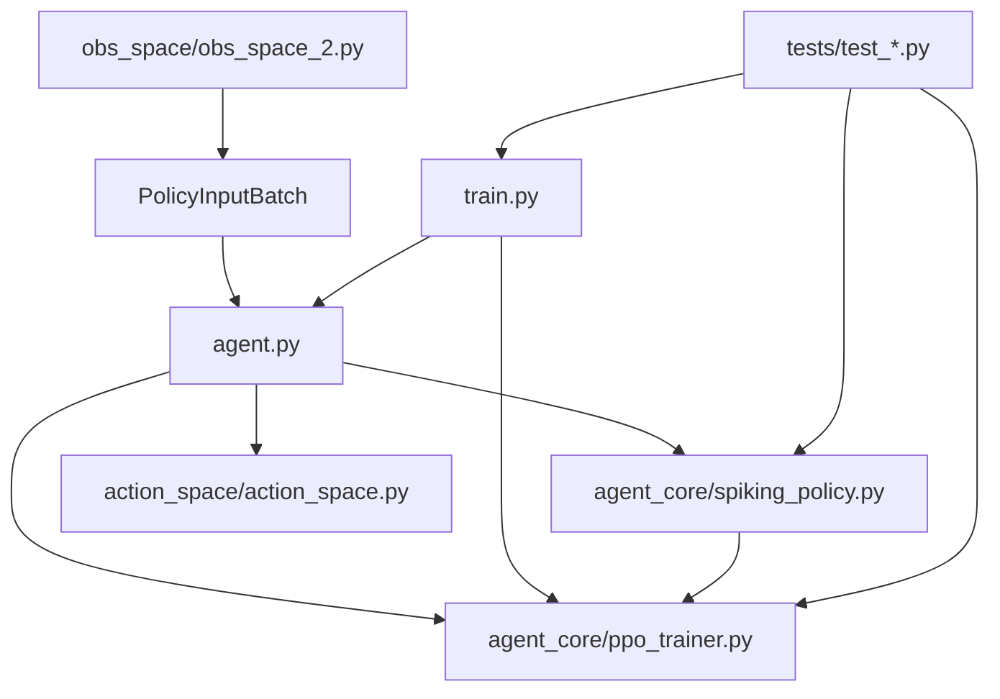

# Frankenmos SNN_roadmap BPTT_test Review and Patch Plan

## Executive summary

The branch that matters is `BPTT_test`, not `master`. On that branch, the chat context mostly matches the repository as-is: the live runtime is now `train.py` + `agent.py` + `agent_core/*`; `PPO_CNN_run.py` is only a backward-compatible shim; the observation protocol has already been refactored into `PolicyInputBatch`; and the action space has already been collapsed to `NO_OP + SMART`. fileciteturn50file0L1-L1 fileciteturn42file0L1-L1 fileciteturn38file0L1-L1

The current architecture is much closer to a serious learned SC2 mini-game baseline than the older master branch. It already has the right big pieces: hybrid tokenization, availability masking, action-conditioned click logits, TBPTT chunk replay, packed recurrent replay, and a dual-timescale spiking temporal core. fileciteturn50file0L1-L1 fileciteturn39file0L1-L1 fileciteturn40file0L1-L1

The highest-confidence problems are also clear:

- **The click head is still starved of spatial structure.** The current policy pools all token groups into a single group-summary vector, and `conditioned_spatial_head()` predicts x/y from that pooled latent rather than from a retained spatial token map. That is the most important learning bottleneck for `SMART(x, y)`. fileciteturn39file0L1-L1
- **Spatial tokens still lack explicit 2D positional encoding.** Transformers without recurrence/convolution need injected positional information; otherwise token identity is ambiguous. That is a known requirement from the original Transformer literature, and DETR-style vision transformers also rely on encoded spatial position. citeturn16view1turn15view0
- **`policy_mask` is not yet a true training mask.** In the current PPO loss, policy and entropy are masked, but the critic still trains on masked-out helper steps. That leaks value targets from steps you explicitly intended to exclude from learning. fileciteturn40file0L1-L1
- **Evaluation currently runs before a due PPO update.** In `train.py`, the eval block precedes the “rollout full → update” block, so the logged deterministic eval can lag the actual latest policy by one update window. fileciteturn43file0L1-L1
- **Recurrent-state assertions are too weak at the trainer boundary.** `PolicyInputBatch` does some validation and the policy forward path checks shapes, but `store_transition()` and `set_final_next()` still accept batches with missing or malformed `state_in`, which is exactly the kind of silent failure that corrupts TBPTT and is painful to diagnose. fileciteturn38file0L1-L1 fileciteturn39file0L1-L1 fileciteturn40file0L1-L1

My bottom-line judgment is: **yes, this branch can plausibly learn after these fixes**, especially on `DefeatRoaches`, but the learning odds depend much more on repairing the spatial click pathway than on changing the SNN itself. The action-space simplification to `SMART` is reasonable for a baseline if the click head can actually localize. SC2LE’s own baselines showed that preserving spatial structure matters for screen actions, and conditioning arguments on action type helps; AlphaStar pushed this farther with autoregressive action arguments and a pointer-style output stack. citeturn17view0turn8search3

## Repository map and divergence from the chat

### What I inspected

I inspected the full file contents on branch `BPTT_test` for the following files. The GitHub connector returned each as a full-file fetch, so this inspection is “line 1 through EOF” for each file, even though the connector citation itself is single-chunk rather than line-granular.

- `agent_core/policy_protocol.py` — constants, action IDs, `PolicyInputBatch`, mask and recurrent-state validation. fileciteturn38file0L1-L1
- `agent_core/spiking_policy.py` — entity/selection/meta encoders, attention block, dual-timescale token SNN, `encode_step_tensors()`, `conditioned_spatial_head()`. fileciteturn39file0L1-L1
- `agent_core/ppo_trainer.py` — masked availability logic, `select_action()`, rollout storage, TBPTT chunking, packed replay, `_calculate_losses()`. fileciteturn40file0L1-L1
- `agent.py` — environment-to-policy control flow, bootstrap `select_army`, `SMART` dispatch, recurrent state handoff. fileciteturn41file0L1-L1
- `train.py` — checkpointing, eval sweep, rollout/update scheduling, helper-step storage semantics. fileciteturn43file0L1-L1
- `PPO_CNN_run.py` — launcher shim only. fileciteturn42file0L1-L1
- `obs_space/obs_space_2.py` — extractor, meta vector layout, last-action bridge token, normalizers. fileciteturn44file0L1-L1
- `action_space/action_space.py` — `SMART` dispatch and executed-action token. fileciteturn45file0L1-L1
- `tests/test_policy_input.py`, `tests/test_agent.py`, `tests/test_PPO.py`, `tests/test_training_loop.py` — current test coverage and the easiest places to extend validation. fileciteturn46file0L1-L1 fileciteturn48file0L1-L1 fileciteturn49file0L1-L1 fileciteturn47file0L1-L1
- `docs/current/REPO_STATE.md`, `docs/current/action_refactor.md`, `config.yaml` — branch status, current action semantics, current defaults. fileciteturn50file0L1-L1 fileciteturn52file0L1-L1 fileciteturn51file0L1-L1

### What matches the chat and what does not

The important result is that **the chat context was not fantasy or local-only drift**. The two big snippets you pasted earlier correspond closely to the actual `BPTT_test` branch:

| Item from chat | Repo status on `BPTT_test` | Assessment |
|---|---|---|
| `PolicyInputBatch` and protocol constants | Present in `agent_core/policy_protocol.py` | **Matches repo** |
| Hybrid token spiking policy with `encode_step_tensors()` and conditioned click head | Present in `agent_core/spiking_policy.py` | **Matches repo** |
| PPO TBPTT packed replay and `policy_mask` | Present in `agent_core/ppo_trainer.py` | **Matches repo** |
| SMART-only action semantics | Present in `agent.py` and `action_space/action_space.py` | **Matches repo** |
| Training loop with eval, rollout flushing, diagnostics, helper masking | Present in `train.py` | **Matches repo** |
| `PPO_CNN_run.py` containing the real trainer | Not true on branch; file is just a shim importing `train.py` | **Name/path divergence** |
| `and finally import json` paste artifact | Not in repo | **Paste-only artifact** |

The most important divergence is simply this: if someone reviews `master`, they will review the wrong architecture. The current research branch is `BPTT_test`, and that is where the real code path lives. fileciteturn50file0L1-L1

### Module relationship



The current runtime split above is exactly what the branch documentation says is “current,” while `PPO_CNN/*` and root `PPO_CNN_*` are now legacy or compatibility wrappers. fileciteturn50file0L1-L1

## Findings and exact patch targets

### The spatial action bottleneck

The strongest architectural issue is in `agent_core/spiking_policy.py`.

Right now the pipeline does something smart and something harmful:

- smart: it keeps separate spatial, entity, selection, and meta token groups, adds token-type embeddings, uses attention, then runs a fast and slow token SNN over the token stream. fileciteturn39file0L1-L1
- harmful: after that, it **group-mean-pools** the entire token set, concatenates the four pooled group summaries, and predicts x/y from the final pooled latent alone. The click head never gets direct access to the 7×7 spatial token map. fileciteturn39file0L1-L1

That is exactly the part SC2LE’s FullyConv baseline warned against: discarding spatial structure before inferring spatial actions is detrimental, because screen actions operate in the same space as the input. SC2LE’s Atari-style baseline factorized x and y from a pooled vector, but its FullyConv baseline preserved resolution and produced a spatial policy directly from a feature map; the paper also notes that autoregressive/conditioned argument prediction improves spatial accuracy further. citeturn17view0turn14view0

Your branch is already halfway to the better setup because the click logits are action-conditioned. The missing half is **retaining structured spatial tokens for the click path**.

**Patch target:** `agent_core/spiking_policy.py`
- `PolicyNetwork.__init__`
- `PolicyNetwork.encode_step_tensors`
- `PolicyNetwork.conditioned_spatial_head`
- `PolicyNetwork.forward_step_tensors`

### Missing explicit spatial positional encoding

The current spatial tokens are pooled CNN outputs flattened into a 49-token sequence. There is no explicit 2D position embedding added after flattening. A CNN gives some locality bias, but once the 7×7 map is flattened into tokens and fed into attention, explicit position still matters. The original Transformer makes this exact point: if a model has no recurrence and no convolution inside the attention stack, positional information must be injected; learned and sinusoidal encodings both worked well. DETR inherits the same principle for vision: a CNN backbone feeds a transformer that reasons globally, but it still relies on positional information and fixed query structure to ground spatial reasoning. citeturn16view1turn16view2turn15view0

**Patch target:** `agent_core/spiking_policy.py`
- `PolicyNetwork.__init__` — define coordinate buffer/projection
- `PolicyNetwork.encode_step_tensors` — add positional encoding to spatial tokens before token fusion

### `policy_mask` is semantically incomplete

The current trainer already stores helper steps with `policy_mask=0.0`, which is the right idea because you want helper/bootstrap transitions present for recurrent replay continuity while excluding them from learning. The trainer then masks policy loss and entropy with `_masked_mean(..., policy_mask)`. But **value loss is still unmasked** and averages over all samples. That means helper steps you intended to exclude still influence the critic. fileciteturn40file0L1-L1

This is not just stylistic. If `policy_mask` means “this sample is part of recurrent continuity but not part of the learning objective,” the critic must respect the same contract. Otherwise the value baseline is trained on a distribution you explicitly tried to exclude.

**Patch target:** `agent_core/ppo_trainer.py`
- `PPO._calculate_losses` — mask value loss and `value_count`
- `tests/test_PPO.py` — add direct regression tests for masked value loss

### Eval currently runs on a stale policy when an update is due

In `train.py`, the order is:

1. finish episode
2. maybe eval
3. if rollout is full, update PPO

So when an eval episode index coincides with a full rollout buffer, deterministic eval measures the **pre-update** policy, even though a PPO update is immediately due. That makes your instrumentation less trustworthy and can delay best-checkpoint promotion by one update window. fileciteturn43file0L1-L1

This is a measurement bug, not a learning-theory bug, but it matters if you are judging whether the branch is “learning.”

**Patch target:** `train.py`
- `train_agent` — move the “if len(memory) >= rollout_steps” update block before the eval block
- `tests/test_training_loop.py` — add an order-of-operations test

### Recurrent-state assertions need to be enforced at storage and bootstrap boundaries

The policy path already has some state sanity checking:

- `PolicyInputBatch._validate()` checks state tuple shape consistency and batch-row match. fileciteturn38file0L1-L1
- `PolicyNetwork._coerce_temporal_state()` checks for legacy rank-3 or multi-timescale rank-4 state and validates exact expected shape. fileciteturn39file0L1-L1

But the trainer boundary still trusts too much:

- `PPO.store_transition()` will store a batch with `state_in=None`.
- `PPO.set_final_next()` will accept any `PolicyInputBatch` without asserting recurrent readiness.
- `PolicyInputBatch` currently accepts any state tensor rank ≥1, even though the policy only knows how to coerce rank 3 or 4. fileciteturn38file0L1-L1 fileciteturn40file0L1-L1

That is a classic TBPTT footgun: a recurrent branch can silently degrade into a “stateless during replay” branch without crashing early.

**Patch targets**
- `agent_core/policy_protocol.py` — tighten allowable `state_in` ranks
- `agent_core/ppo_trainer.py` — assert recurrent-ready batches in `store_transition()` and `set_final_next()`
- `tests/test_policy_input.py` and `tests/test_PPO.py` — enforce failures for malformed or missing recurrent state

## Ready-to-apply patch diffs

### Patch for spatial positional encoding and structured spatial click branch

**Files**
- `agent_core/spiking_policy.py`
- `tests/test_agent.py`

This patch is intentionally minimal. It does **not** replace your factorized x/y click head yet. It keeps the existing x/y heads, but feeds them a **spatially structured residual** derived from the retained 7×7 spatial tokens after attention/SNN, and adds explicit 2D spatial position to those tokens.

```diff
diff --git a/agent_core/spiking_policy.py b/agent_core/spiking_policy.py
index 57b39f9..PATCHED 100644
--- a/agent_core/spiking_policy.py
+++ b/agent_core/spiking_policy.py
@@
 class PolicyNetwork(nn.Module):
@@
         self.token_pool = nn.AdaptiveAvgPool2d(
             (self._pool_size, self._pool_size),
         )
+        grid = torch.linspace(-1.0, 1.0, self._pool_size)
+        yy, xx = torch.meshgrid(grid, grid, indexing="ij")
+        spatial_xy = torch.stack((xx, yy), dim=-1).reshape(-1, 2)
+        self.register_buffer("_spatial_xy", spatial_xy, persistent=False)
+        self.spatial_pos_proj = nn.Linear(2, self._embed_dim)
+
         self.entity_encoder = EntityEncoder(
             feature_dim=len(CURATED_FEATURE_UNIT_FIELDS),
             embed_dim=self._embed_dim,
         )
@@
         self.actor_fc = nn.Linear(64, action_dim)
         self.critic_fc = nn.Linear(64, 1)
         self.action_condition_embedding = nn.Embedding(self._action_dim, 64)
+        self.spatial_click_norm = nn.LayerNorm(self._spatial_tokens * self._embed_dim)
+        self.spatial_click_fc = nn.Sequential(
+            nn.Linear(self._spatial_tokens * self._embed_dim, 64),
+            nn.ReLU(),
+        )
         self.move_x_fc = nn.Linear(64, self.screen_size)
         self.move_y_fc = nn.Linear(64, self.screen_size)
@@
     def _group_masked_mean(
         self,
         tokens: torch.Tensor,
         mask: torch.Tensor,
@@
             summaries.append(summed / count)
         return torch.cat(summaries, dim=-1)
+
+    def _spatial_positional_encoding(
+        self,
+        batch_size: int,
+        device: torch.device,
+        dtype: torch.dtype,
+    ) -> torch.Tensor:
+        coords = self._spatial_xy.to(device=device, dtype=dtype)
+        pos = self.spatial_pos_proj(coords)
+        return pos.unsqueeze(0).expand(batch_size, -1, -1)
+
+    def _encode_spatial_click_context(
+        self,
+        spatial_context: torch.Tensor,
+    ) -> torch.Tensor:
+        flat = spatial_context.flatten(start_dim=1)
+        flat = self.spatial_click_norm(flat)
+        return self.spatial_click_fc(flat)
@@
     def encode_step_tensors(
         self,
         spatial_obs: torch.Tensor,
@@
         x = self.pool(x)
 
         spatial_tokens = self.token_pool(x)
         spatial_tokens = spatial_tokens.flatten(2).transpose(1, 2)
+        spatial_tokens = spatial_tokens + self._spatial_positional_encoding(
+            batch_size=spatial_tokens.size(0),
+            device=spatial_tokens.device,
+            dtype=spatial_tokens.dtype,
+        )
         batch_size = spatial_tokens.size(0)
         device = spatial_tokens.device
@@
         syn_tok, mem_tok = self._zero_entity_state(syn_tok, mem_tok)
 
         aggregated = torch.stack(spike_rec, dim=0).sum(dim=0)
+        spatial_context = aggregated[:, : self._spatial_tokens, :]
         pooled = self._group_masked_mean(aggregated, token_mask)
         combined = self.combined_norm(pooled)
 
         latent = F.relu(self.shared_fc1(combined))
         latent = F.relu(self.shared_fc2(latent))
         state_value = self.critic_fc(latent).squeeze(-1)
         next_state = (syn_tok, mem_tok)
-        return latent, state_value, next_state
+        return latent, state_value, next_state, spatial_context
@@
     def conditioned_spatial_head(
         self,
         latent: torch.Tensor,
+        spatial_context: torch.Tensor,
         action_ids: torch.Tensor | None,
     ) -> tuple[torch.Tensor, torch.Tensor]:
         if action_ids is None:
             action_ids = torch.full(
                 (latent.size(0),),
@@
         else:
             action_ids = action_ids.to(device=latent.device, dtype=torch.long)
         action_ids = action_ids.clamp(0, self._action_dim - 1)
-        conditioned = latent + self.action_condition_embedding(action_ids)
+        conditioned = latent + self.action_condition_embedding(action_ids)
+        conditioned = conditioned + self._encode_spatial_click_context(spatial_context)
         return self.move_x_fc(conditioned), self.move_y_fc(conditioned)
@@
     def forward_step_tensors(
         self,
         spatial_obs: torch.Tensor,
@@
         state_in: tuple[torch.Tensor, torch.Tensor] | None,
         action_ids: torch.Tensor | None = None,
     ):
-        latent, state_value, next_state = self.encode_step_tensors(
+        latent, state_value, next_state, spatial_context = self.encode_step_tensors(
             spatial_obs=spatial_obs,
             entity_features=entity_features,
             entity_mask=entity_mask,
@@
         if action_ids is None:
             action_ids = action_logits.float().argmax(dim=-1)
         move_x_logits, move_y_logits = self.conditioned_spatial_head(
             latent,
+            spatial_context,
             action_ids,
         )
         return action_logits, move_x_logits, move_y_logits, state_value, next_state
```

```diff
diff --git a/agent_core/ppo_trainer.py b/agent_core/ppo_trainer.py
index d990ad1..PATCHED 100644
--- a/agent_core/ppo_trainer.py
+++ b/agent_core/ppo_trainer.py
@@
         with torch.no_grad(), torch.amp.autocast(
             "cuda",
             dtype=self.policy_net.amp_dtype,
             enabled=self.policy_net.use_amp,
         ):
-            latent, state_value, next_state = self.policy_net.encode_step_tensors(
+            latent, state_value, next_state, spatial_context = self.policy_net.encode_step_tensors(
                 spatial_obs=batch.spatial_obs,
                 entity_features=batch.entity_features,
                 entity_mask=batch.entity_mask,
@@
             move_x_logits, move_y_logits = self.policy_net.conditioned_spatial_head(
                 latent,
+                spatial_context,
                 action,
             )
@@
     def _forward_replay_step_tensors(
         self,
         spatial_obs: torch.Tensor,
@@
         action_ids: torch.Tensor | None,
         state_in: tuple[torch.Tensor, torch.Tensor] | None,
     ):
-        latent, state_value, next_state = self.policy_net.encode_step_tensors(
+        latent, state_value, next_state, spatial_context = self.policy_net.encode_step_tensors(
             spatial_obs=spatial_obs,
             entity_features=entity_features,
             entity_mask=entity_mask,
@@
         move_x_logits, move_y_logits = self.policy_net.conditioned_spatial_head(
             latent,
+            spatial_context,
             action_ids,
         )
         return action_logits, move_x_logits, move_y_logits, state_value, next_state
```

```diff
diff --git a/tests/test_agent.py b/tests/test_agent.py
index 161e68f..PATCHED 100644
--- a/tests/test_agent.py
+++ b/tests/test_agent.py
@@
 def test_conditioned_spatial_head_changes_with_action_id():
     net = _small_policy()
     batch = _policy_batch(batch_size=2, spatial_shape=SPATIAL_OBS_SHAPE)
-    latent, _value, _next_state = net.encode_step_tensors(
+    latent, _value, _next_state, spatial_context = net.encode_step_tensors(
         spatial_obs=batch.spatial_obs,
         entity_features=batch.entity_features,
         entity_mask=batch.entity_mask,
@@
     smart_x_logits, smart_y_logits = net.conditioned_spatial_head(
         latent,
+        spatial_context,
         torch.full((2,), POLICY_ACTION_SMART, dtype=torch.long),
     )
     no_op_x_logits, no_op_y_logits = net.conditioned_spatial_head(
         latent,
+        spatial_context,
         torch.zeros((2,), dtype=torch.long),
     )
@@
     assert not torch.allclose(smart_x_logits, no_op_x_logits)
     assert not torch.allclose(smart_y_logits, no_op_y_logits)
+
+
+def test_conditioned_spatial_head_uses_spatial_context():
+    net = _small_policy()
+    batch = _policy_batch(batch_size=2, spatial_shape=SPATIAL_OBS_SHAPE)
+    latent, _value, _next_state, spatial_context = net.encode_step_tensors(
+        spatial_obs=batch.spatial_obs,
+        entity_features=batch.entity_features,
+        entity_mask=batch.entity_mask,
+        selection_features=batch.selection_features,
+        selection_mask=batch.selection_mask,
+        meta_vec=batch.meta_vec,
+        state_in=batch.state_in,
+    )
+
+    zeros = torch.zeros_like(spatial_context)
+    logits_a = net.conditioned_spatial_head(
+        latent,
+        spatial_context,
+        torch.full((2,), POLICY_ACTION_SMART, dtype=torch.long),
+    )
+    logits_b = net.conditioned_spatial_head(
+        latent,
+        zeros,
+        torch.full((2,), POLICY_ACTION_SMART, dtype=torch.long),
+    )
+
+    assert not torch.allclose(logits_a[0], logits_b[0])
+    assert not torch.allclose(logits_a[1], logits_b[1])
```

### Patch for `policy_mask` as a true training mask

**Files**
- `agent_core/ppo_trainer.py`
- `tests/test_PPO.py`

```diff
diff --git a/agent_core/ppo_trainer.py b/agent_core/ppo_trainer.py
index d990ad1..PATCHED 100644
--- a/agent_core/ppo_trainer.py
+++ b/agent_core/ppo_trainer.py
@@
         policy_loss = -self._masked_mean(torch.min(surr1, surr2), policy_mask)
 
-        value_loss = (
-            self.critic_loss_coef * (returns - state_values).pow(2).mean()
-        )
+        value_loss = self.critic_loss_coef * self._masked_mean(
+            (returns - state_values).pow(2),
+            policy_mask,
+        )
@@
         return policy_loss, value_loss, entropy_loss, {
             "approx_kl": approx_kl,
             "clip_frac": clip_frac,
             "entropy_mean": entropy_mean,
             "policy_count": policy_count.detach(),
-            "value_count": torch.tensor(
-                float(state_values.numel()),
-                device=state_values.device,
-            ),
+            "value_count": policy_count.detach(),
         }
```

```diff
diff --git a/tests/test_PPO.py b/tests/test_PPO.py
index b0b94ad..PATCHED 100644
--- a/tests/test_PPO.py
+++ b/tests/test_PPO.py
@@
 def test_calculate_losses_no_op_samples_do_not_backprop_spatial_heads():
@@
     if move_y_logits.grad is not None:
         assert torch.count_nonzero(move_y_logits.grad) == 0
+
+
+def test_calculate_losses_masks_value_loss_with_policy_mask():
+    ppo = PPO(FakeNet(), lr=1e-4)
+    batch = 2
+    action_logits = torch.zeros(batch, 2, requires_grad=True)
+    move_x_logits = torch.zeros(batch, 8, requires_grad=True)
+    move_y_logits = torch.zeros(batch, 8, requires_grad=True)
+    state_values = torch.tensor([2.0, 50.0], requires_grad=True)
+    returns = torch.tensor([0.0, 0.0])
+    mask = torch.tensor([1.0, 0.0])
+
+    _policy_loss, value_loss, _entropy_loss, diag = ppo._calculate_losses(
+        action_logits,
+        move_x_logits,
+        move_y_logits,
+        state_values,
+        torch.tensor([0, 0], dtype=torch.long),
+        torch.tensor([0, 0], dtype=torch.long),
+        torch.tensor([0, 0], dtype=torch.long),
+        torch.zeros(batch),
+        torch.ones(batch),
+        returns,
+        policy_mask=mask,
+    )
+
+    expected = ppo.critic_loss_coef * (returns[0] - state_values[0]).pow(2)
+    assert value_loss.item() == pytest.approx(float(expected.item()), abs=1e-6)
+    assert float(diag["value_count"].item()) == pytest.approx(1.0, abs=1e-6)
```

### Patch for update-before-eval ordering

**Files**
- `train.py`
- `tests/test_training_loop.py`

```diff
diff --git a/train.py b/train.py
index 49c0596..PATCHED 100644
--- a/train.py
+++ b/train.py
@@
-        if eval_frequency > 0 and eval_episodes > 0 and (episode + 1) % eval_frequency == 0:
+        if len(agent.ppo.memory) >= rollout_steps:
+            maybe_run_policy_update(agent, log_queue, episode + 1)
+
+        if eval_frequency > 0 and eval_episodes > 0 and (episode + 1) % eval_frequency == 0:
             eval_summary = run_eval_sweep(
                 env=env,
                 agent=agent,
@@
-        if len(agent.ppo.memory) >= rollout_steps:
-            maybe_run_policy_update(agent, log_queue, episode + 1)
-
         if (episode + 1) % cfg.environment.log_frequency == 0:
             save_checkpoint(
                 agent,
```

```diff
diff --git a/tests/test_training_loop.py b/tests/test_training_loop.py
index d318173..PATCHED 100644
--- a/tests/test_training_loop.py
+++ b/tests/test_training_loop.py
@@
 def test_train_agent_stores_helper_steps_for_recurrent_replay(monkeypatch):
@@
     assert agent.ppo.store_calls == 2
     assert agent.ppo.final_next_calls == 2
+
+
+def test_train_agent_updates_before_eval_when_rollout_is_ready(monkeypatch):
+    env = DummyEnv([2, 2])
+    agent = DummyAgent()
+    queue = DummyQueue()
+    eval_seen_update_calls = []
+
+    monkeypatch.setattr(run_mod.cfg.environment, "total_episodes", 2, raising=False)
+    monkeypatch.setattr(run_mod.cfg.environment, "steps_per_episode", 10, raising=False)
+    monkeypatch.setattr(run_mod.cfg.environment, "reward_window", 10, raising=False)
+    monkeypatch.setattr(run_mod.cfg.environment, "log_frequency", 999, raising=False)
+    monkeypatch.setattr(run_mod.cfg.environment, "eval_frequency", 1, raising=False)
+    monkeypatch.setattr(run_mod.cfg.environment, "eval_episodes", 1, raising=False)
+    monkeypatch.setattr(run_mod.cfg.environment, "best_min_episodes", 9999, raising=False)
+    monkeypatch.setattr(run_mod.cfg.hyperparameters, "rollout_steps", 4, raising=False)
+    monkeypatch.setattr(run_mod.cfg.hyperparameters, "reward_scale", 1.0, raising=False)
+
+    def _fake_eval(*args, **kwargs):
+        eval_seen_update_calls.append(agent.update_calls)
+        return {
+            "num_episodes": 1,
+            "mean_reward": 0.0,
+            "std_reward": 0.0,
+            "min_reward": 0.0,
+            "max_reward": 0.0,
+            "deterministic": True,
+        }
+
+    with patch.object(
+        run_mod,
+        "load_checkpoint",
+        return_value=(0, float("-inf"), deque(maxlen=10)),
+    ), patch.object(run_mod, "run_eval_sweep", side_effect=_fake_eval):
+        run_mod.train_agent(env, agent, None, queue)
+
+    assert eval_seen_update_calls[-1] == 1
```

### Patch for recurrent-state assertions

**Files**
- `agent_core/policy_protocol.py`
- `agent_core/ppo_trainer.py`
- `tests/test_policy_input.py`
- `tests/test_PPO.py`

```diff
diff --git a/agent_core/policy_protocol.py b/agent_core/policy_protocol.py
index 9e0b778..PATCHED 100644
--- a/agent_core/policy_protocol.py
+++ b/agent_core/policy_protocol.py
@@
         if self.state_in is not None:
             if not isinstance(self.state_in, tuple) or len(self.state_in) != 2:
                 raise TypeError("state_in must be a (syn, mem) tensor tuple or None")
             syn, mem = self.state_in
             if not isinstance(syn, torch.Tensor) or not isinstance(mem, torch.Tensor):
                 raise TypeError("state_in must contain tensors")
             if syn.shape != mem.shape:
                 raise ValueError(
                     f"state_in tensors must share a shape, got {syn.shape} and {mem.shape}",
                 )
+            if syn.ndim not in (3, 4):
+                raise ValueError(
+                    "state_in tensors must be rank-3 legacy or rank-4 multi-timescale, "
+                    f"got ndim={syn.ndim}",
+                )
             if syn.ndim < 1 or int(syn.shape[0]) != expected_batch:
                 raise ValueError(
                     f"state_in batch dimension must match spatial_obs: "
                     f"{syn.shape[0] if syn.ndim else 'scalar'} != {expected_batch}",
                 )
```

```diff
diff --git a/agent_core/ppo_trainer.py b/agent_core/ppo_trainer.py
index d990ad1..PATCHED 100644
--- a/agent_core/ppo_trainer.py
+++ b/agent_core/ppo_trainer.py
@@
 class PPO:
@@
     def set_final_next(self, observation_batch: PolicyInputBatch):
+        self._assert_recurrent_ready(observation_batch, context="set_final_next")
         self.final_next = observation_batch.detach().to(device="cpu")
@@
     def store_transition(
         self,
         observation_batch: PolicyInputBatch,
@@
         done: torch.Tensor,
         policy_mask: torch.Tensor | None = None,
     ):
+        self._assert_recurrent_ready(observation_batch, context="store_transition")
         if policy_mask is None:
             policy_mask = torch.tensor(1.0, dtype=torch.float32)
         self.memory.append(
@@
             }
         )
+
+    @staticmethod
+    def _assert_recurrent_ready(
+        observation_batch: PolicyInputBatch,
+        context: str,
+    ) -> None:
+        if not isinstance(observation_batch, PolicyInputBatch):
+            raise TypeError(
+                f"{context} expects PolicyInputBatch, got {type(observation_batch)!r}",
+            )
+        if observation_batch.state_in is None:
+            raise ValueError(
+                f"{context} requires observation_batch.state_in for recurrent TBPTT replay",
+            )
+        syn, mem = observation_batch.state_in
+        if syn.shape != mem.shape:
+            raise ValueError(
+                f"{context} requires matching syn/mem shapes, got {syn.shape} and {mem.shape}",
+            )
+        if int(syn.shape[0]) != observation_batch.batch_size:
+            raise ValueError(
+                f"{context} requires recurrent batch rows to match batch size: "
+                f"{syn.shape[0]} != {observation_batch.batch_size}",
+            )
```

```diff
diff --git a/tests/test_policy_input.py b/tests/test_policy_input.py
index f999d00..PATCHED 100644
--- a/tests/test_policy_input.py
+++ b/tests/test_policy_input.py
@@
 def test_policy_input_batch_rejects_non_bool_masks():
@@
         )
+
+
+def test_policy_input_batch_rejects_invalid_state_rank():
+    with pytest.raises(ValueError, match="rank-3 legacy or rank-4 multi-timescale"):
+        PolicyInputBatch(
+            spatial_obs=torch.randn(1, *SPATIAL_OBS_SHAPE),
+            entity_features=torch.randn(1, MAX_ENTITY_TOKENS, 20),
+            entity_mask=torch.ones(1, MAX_ENTITY_TOKENS, dtype=torch.bool),
+            selection_features=torch.randn(
+                1,
+                MAX_SELECTION_TOKENS,
+                SELECTION_FEATURE_DIM,
+            ),
+            selection_mask=torch.ones(1, MAX_SELECTION_TOKENS, dtype=torch.bool),
+            meta_vec=torch.randn(1, 37),
+            state_in=(torch.randn(1, 64), torch.randn(1, 64)),
+        )
```

```diff
diff --git a/tests/test_PPO.py b/tests/test_PPO.py
index b0b94ad..PATCHED 100644
--- a/tests/test_PPO.py
+++ b/tests/test_PPO.py
@@
 def test_select_action_no_op_ignores_spatial_log_prob():
@@
     assert log_prob == pytest.approx(float(expected_log_prob.item()), abs=1e-6)
+
+
+def test_store_transition_requires_recurrent_state():
+    ppo = PPO(FakeNet(), lr=1e-4)
+    batch = make_policy_batch(batch_size=1, meta_dim=8).with_state(None)
+    with pytest.raises(ValueError, match="requires observation_batch.state_in"):
+        ppo.store_transition(
+            batch,
+            torch.tensor(0),
+            torch.tensor(0),
+            torch.tensor(0),
+            torch.tensor(0.0),
+            torch.tensor(0.0),
+            torch.tensor(0.0),
+            torch.tensor(1.0),
+        )
+
+
+def test_set_final_next_requires_recurrent_state():
+    ppo = PPO(FakeNet(), lr=1e-4)
+    batch = make_policy_batch(batch_size=1, meta_dim=8).with_state(None)
+    with pytest.raises(ValueError, match="requires observation_batch.state_in"):
+        ppo.set_final_next(batch)
```

### Commit granularity suggestion

Make these four commits separately:

1. `tbptt/assert-recurrent-state-boundaries`
2. `ppo/mask-critic-with-policy-mask`
3. `train/update-before-eval`
4. `policy/add-spatial-posenc-and-structured-click-branch`

That order gives you clean bisects and isolates “measurement/debugging fixes” from “learning behavior fixes.”

## Literature rationale and design alternatives

### Why these fixes are the right ones

The original Transformer paper is explicit: if you do not have recurrence or convolution in the sequence-processing module, you must inject position. It also reports that learned and sinusoidal positional encodings perform similarly, which means a small learned 2D coordinate projection is a perfectly defensible choice here. citeturn16view1turn16view2

SC2LE is even more directly relevant. Its baseline analysis distinguishes between a pooled-vector Atari-style architecture and a resolution-preserving FullyConv architecture. The paper states that discarding spatial structure before action inference is harmful for screen/minimap actions, and its FullyConv spatial policy is produced directly from a convolutional state map. It also highlights that argument prediction improves when conditioned on the base action, because “where to click” depends on “what the click means.” Your branch already captured the second insight via the conditioned spatial head; it has not yet captured the first one strongly enough. citeturn17view0turn14view0

AlphaStar is the next reference point. DeepMind’s own description says AlphaStar uses a transformer torso over units, a deep recurrent core, and an autoregressive policy head with a pointer network. That architecture choice is not cosmetic: StarCraft actions are structured and high-dimensional, so argument selection is easier when conditioned on earlier action decisions and when localization stays tied to structured scene representations rather than a single pooled latent. citeturn8search3turn8search7

GTrXL is relevant for your “swap out the SNN later?” question, but it is **not** the first thing I would change right now. The RL literature shows that transformers in partially observable RL can be strong, but they needed stability modifications precisely because vanilla transformer recurrence is brittle under RL objectives. That argues for keeping your recurrent core conservative while you fix the obviously broken spatial pathway first. citeturn11search0

### Why I am recommending factorized x/y plus structured spatial context first

Your current head predicts separate x and y distributions. That is not inherently wrong. SC2LE’s simple baseline did this explicitly for the Atari-style agent, and using separate x/y heads is often a perfectly acceptable compromise for mini-game click prediction. The problem is not factorization by itself. The problem is **factorization from an over-pooled latent**. citeturn17view0

So the safest next patch is:

- keep the current factorized x/y loss
- keep the action-conditioned head
- add 2D positional encoding
- feed the click head a retained spatial token map

That gets you most of the likely benefit with the smallest code churn.

### Comparison of spatial-head options

| Design | What it means in this repo | Pros | Cons | Estimated effort |
|---|---|---|---|---|
| **Flatten + MLP over retained 7×7 spatial tokens + factorized x/y** | Keep current x/y heads, add spatial token residual and position encoding | Minimal churn, easiest to test, preserves most of your current trainer and action API | Still assumes x and y are conditionally separable | **Low** |
| **Conv/deconv heatmap head** | Predict a 2D click heatmap from 7×7 or 14×14 structured features, then sample argmax/categorical over 2D map | Better spatial coherence, natural for screen clicks, closer to SC2LE FullyConv spirit | More invasive loss and sampling changes, more checkpoint incompatibility | **Medium** |
| **Attention/pointer-style spatial head** | Query the spatial token map using action-conditioned latent, optionally choose a cell/token then refine coordinates | Closest in spirit to AlphaStar-style structured action heads | Highest implementation and debugging cost, especially with TBPTT + SNN core | **High** |

The literature support for this ordering is strong: SC2LE already showed that preserving spatial structure helps, and AlphaStar shows the general direction of structured/conditional action arguments. DETR supports the idea that a CNN + global transformer + explicit positional information is a solid and extensible pattern for structured spatial reasoning. citeturn14view0turn8search3turn15view0turn16view1

## Validation plan and expected impact

### What to test immediately

Run the targeted unit tests first:

```bash
pytest tests/test_policy_input.py -q
pytest tests/test_agent.py -q
pytest tests/test_PPO.py -q
pytest tests/test_training_loop.py -q
pytest tests -q
```

These are the right files because the current branch already has coverage exactly where your patches land: protocol, policy network, PPO loss/replay, and training-loop ordering. fileciteturn46file0L1-L1 fileciteturn48file0L1-L1 fileciteturn49file0L1-L1 fileciteturn47file0L1-L1

### What to ablate during training

Use one frozen `config.yaml` per run and only vary the code commit. The repo does not currently expose full hyperparameter overrides on CLI, so the cleanest reproducible protocol is “one commit/tag per ablation, one `--run_name` per run.” fileciteturn51file0L1-L1

Recommended sequence:

```bash
python train.py --run_name bptt_baseline
python train.py --run_name bptt_mask_eval_asserts
python train.py --run_name bptt_posenc_only
python train.py --run_name bptt_posenc_spatialclick
```

Interpretation:

- `bptt_mask_eval_asserts` should mainly improve trustworthiness and failure visibility, not raw learning.
- `bptt_posenc_only` is a clean low-risk architectural ablation.
- `bptt_posenc_spatialclick` is the real learning ablation.

### Metrics that matter most

Watch these before/after:

- deterministic eval mean reward
- stochastic training reward trend
- fraction of `SMART` vs `NO_OP`
- click-coordinate dispersion and entropy
- distance from click to nearest roach centroid in saved eval traces
- PPO explained variance
- KL, clip fraction, and nonfinite gradient counts
- helper-step percentage vs learnable-step percentage

The reason to emphasize deterministic eval and traces is that your current repo state already says deterministic behavior has been weak even while shaped training reward improved, which is exactly the pattern you would expect if the click head is semantically underpowered or the reward is exploitable. fileciteturn50file0L1-L1

### Risk and impact estimate

| Fix | Learning impact | Instrumentation impact | Risk |
|---|---|---|---|
| Recurrent-state assertions | Low direct | **High** | Low |
| Mask critic with `policy_mask` | Medium | Medium | Low |
| Update-before-eval ordering | Low direct | **High** | Low |
| Spatial positional encoding | Medium | Low | Low |
| Structured spatial click branch | **High** | Medium | Medium |

My best estimate is:

- **Most likely to change actual learning:** structured spatial click branch
- **Most likely to change evaluation trustworthiness quickly:** update-before-eval + assertions
- **Most likely to reduce helper-step contamination:** masked critic

### Expected learning outcome

I would not promise instant success, but I do think these changes move the branch from “architecturally handicapped for click localization” to “plausibly learnable baseline.” That judgment is based on four things together:

1. the repo already has a much better action API than master, because `SMART` plus action conditioning is cleaner than the prior `MOVE/ATTACK` split for this mini-game, fileciteturn52file0L1-L1
2. SC2LE-style baselines strongly favor preserving spatial structure for spatial actions, citeturn14view0turn17view0
3. explicit positional information is a standard transformer requirement, citeturn16view1
4. the current remaining spatial head is still solving localization from too-global a representation. fileciteturn39file0L1-L1

So the realistic expectation is:

- **yes**, better chance of learning coherent `SMART` target selection,
- **yes**, better chance deterministic eval moves off flat zero,
- **no**, not guaranteed that reward shaping is suddenly “solved,”
- **no**, this does not by itself answer whether the long-term backbone should stay SNN versus GTrXL or another dense recurrent model.

## Timeline and checklist

### Suggested implementation flow


### Practical checklist

- [ ] Patch `PolicyInputBatch` to reject invalid recurrent state rank
- [ ] Patch `PPO.store_transition()` and `PPO.set_final_next()` to require recurrent-ready batches
- [ ] Patch `_calculate_losses()` so value loss uses `policy_mask`
- [ ] Move rollout update before eval in `train_agent`
- [ ] Add learned 2D positional encoding to spatial tokens
- [ ] Preserve post-attention/post-SNN spatial token map and feed it into `conditioned_spatial_head`
- [ ] Extend `tests/test_agent.py`, `tests/test_PPO.py`, `tests/test_policy_input.py`, `tests/test_training_loop.py`
- [ ] Run `pytest tests -q`
- [ ] Start a fresh training run for the spatial-head patch
- [ ] Compare deterministic eval and trace quality against the pre-patch run

## Open questions and limitations

The most important limitation of this review is not architectural but practical: I did **not** do a fresh full audit of `reward_v3` dynamics or of `eval.py`’s CLI surface in this pass. The reward stack still matters a lot, and the repo’s own status document says reward refactor/rebalance remains urgent. So this report should be read as “fix the obvious architecture/trainer blockers first,” not “the reward is already perfect.” fileciteturn50file0L1-L1

A second limitation is line granularity from the connector: the GitHub connector returned full-file fetches as single chunks, so I can certify full-file inspection on the listed files, but I cannot attach exact per-function line-span citations from the connector output itself. That is why the patch targets are given by exact file and function name rather than numeric line offsets.

The final open question is the one you were already circling in the chat: if this branch still struggles after these repairs, the next architecture question is probably not “make the SNN weirder,” but “does a denser recurrent backbone or a GTrXL-style backbone offer a better scaling path?” The literature absolutely supports transformers in partially observable RL, but it also says they need stability-minded design; that is a later comparison, not the first repair to make here. citeturn11search0turn8search3