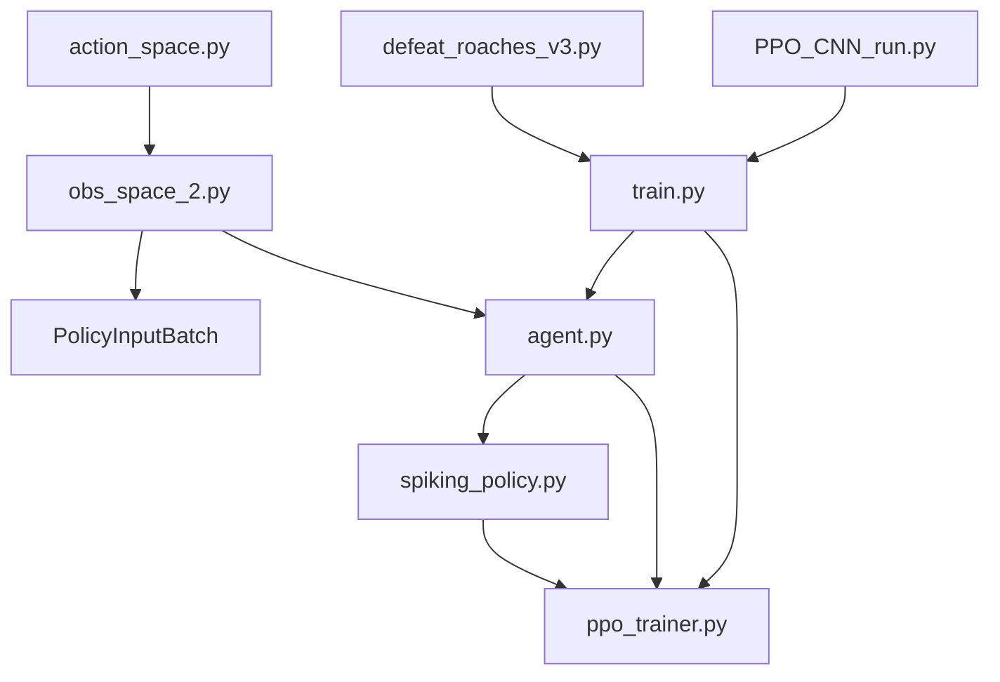

# Current-state review of the local `BPTT_test` code and what is still worth fixing

## Executive summary

Your current findings are mostly correct.

The **old headline issues are already landed in the local code**. The live policy now has explicit learned 2D spatial positional encoding, it retains a structured spatial map for the click pathway, PPO now masks the critic with the training mask, and the trainer now runs `maybe_run_policy_update()` before deterministic eval. Those were the highest-value architectural and trainer fixes from the earlier review, and they are visible directly in the current local files. fileciteturn53file2L423-L435 fileciteturn53file2L453-L470 fileciteturn53file2L704-L811 fileciteturn53file2L816-L859 fileciteturn53file1L1194-L1215 fileciteturn53file1L1242-L1250 fileciteturn53file8L474-L477

What remains live is much less glamorous and much more semantic:

- **time-cap semantics are still unresolved**: `done = env_done or time_cap` is still what the trainer stores, so PPO still treats a step-cap truncation like a terminal unless you deliberately decide that the cap is part of the task horizon. fileciteturn53file8L382-L385 fileciteturn53file1L280-L294
- **rollout cadence is still only checked at episode boundaries**: the update trigger exists, but it only fires after the episode loop closes, so long episodes can overshoot the target rollout length and make data slightly staler than necessary. fileciteturn53file8L341-L348 fileciteturn53file8L474-L477
- **the recurrent-state contract is still stricter in the policy than in the protocol**: `spiking_policy.py` only accepts rank-3 legacy or rank-4 multi-timescale state, but `PolicyInputBatch` still accepts any rank with a matching batch dimension. fileciteturn53file2L632-L655 fileciteturn53file0L333-L345
- **`attention_pool_size` is still configurable while the observation protocol still hard-codes 49 spatial tokens**, so protocol/config drift remains possible. fileciteturn53file0L9-L16 fileciteturn53file2L389-L394 fileciteturn53file2L423-L435 fileciteturn53file6L121-L128
- **the action-history bridge is still only a single 4-float token**, so your newer idea of a short causal command-history buffer is not yet present. fileciteturn53file0L81-L85 fileciteturn53file0L97-L100 fileciteturn53file4L28-L35 fileciteturn53file4L58-L62 fileciteturn53file5L347-L359 fileciteturn53file5L362-L384 fileciteturn53file2L220-L233

The practical conclusion is:

- **do not treat the old “review_architectural_fixes_2026-04-23 (formerly `Solutions_next-fix`)” set as the current to-do list anymore**
- **do treat it as a historical architectural review that already shaped the current branch**
- **the next meaningful fixes are semantic-contract fixes, not another round of spatial-head surgery**

The literature supports that reading. SC2LE’s FullyConv analysis strongly supports preserving spatial structure for spatial actions, and the current local policy now does that in a reasonable factorized-x/y form; DETR and the original Transformer support the use of explicit position once you flatten spatial features into tokens; GTrXL supports later temporal-core comparison, but not as the first next move; and Pardo et al. makes the time-limit question unavoidably explicit: either the limit is part of the task and time must be in state, or it is only a truncation aid and you should continue bootstrapping through it. ([researchgate.net](https://www.researchgate.net/publication/319151530_StarCraft_II_A_New_Challenge_for_Reinforcement_Learning))

## The information I needed to answer well

I needed five things.

First, I needed to verify **which of the earlier “fixes” are already in the local code** rather than only in the chat history. That required checking the current local `spiking_policy.py`, `ppo_trainer.py`, `train.py`, and `policy_protocol.py`. fileciteturn53file2L423-L435 fileciteturn53file1L1194-L1215 fileciteturn53file8L474-L477

Second, I needed to verify **what is still unresolved in training semantics**, especially timeout handling, rollout flushing cadence, and recurrent-state invariants. fileciteturn53file8L382-L385 fileciteturn53file8L474-L477 fileciteturn53file2L632-L655 fileciteturn53file0L333-L345

Third, I needed to locate **where the single-action bridge is implemented**, because your newer “causal command-history token group” idea depends on exactly how the current 4-float bridge is threaded through the action space, observation extractor, protocol, and meta encoder. fileciteturn53file4L28-L35 fileciteturn53file5L347-L359 fileciteturn53file2L220-L233

Fourth, I needed to verify **whether current code matches your summary of `review_architectural_fixes_2026-04-23 (formerly `Solutions_next-fix`).md` and `REPO_STATE.md`**. Those two docs were **not** among the local files supplied here, so that mapping has to be treated as an indirect validation from your quoted claims against the code, not as a direct document audit.

Fifth, I needed to ground the recommendations in **primary literature**, especially on spatial-action prediction, positional encoding, structured action arguments, partially observable RL sequence models, and time-limit handling. ([researchgate.net](https://www.researchgate.net/publication/319151530_StarCraft_II_A_New_Challenge_for_Reinforcement_Learning))

## Exact local files and functions inspected

You explicitly told me to stop relying on GitHub and treat the pasted local files as authoritative. That is what this report does.

| Local file | Functions / sections inspected | Why it mattered |
|---|---|---|
| `policy_protocol.py` | constants, `PolicyInputBatch`, `_validate()` | protocol constants, meta width contract, recurrent-state contract looseness fileciteturn53file0L9-L16 fileciteturn53file0L81-L85 fileciteturn53file0L97-L100 fileciteturn53file0L123-L145 fileciteturn53file0L284-L345 |
| `ppo_trainer.py` | `_policy_action_availability`, `select_action`, `set_final_next`, `store_transition`, `update_policy`, `_calculate_losses` | availability semantics, masked critic, recurrent-state requirements, timeout bootstrapping logic fileciteturn53file1L81-L95 fileciteturn53file1L107-L149 fileciteturn53file1L192-L239 fileciteturn53file1L280-L294 fileciteturn53file1L1194-L1215 fileciteturn53file1L1242-L1250 |
| `spiking_policy.py` | `PolicyNetwork.__init__`, `_coerce_temporal_state`, `_add_spatial_positional_encoding`, `encode_step_tensors`, `conditioned_spatial_head`, `forward_step_tensors` | verifies landed spatial posenc + structured click branch, and stricter rank expectations than the protocol layer fileciteturn53file2L389-L394 fileciteturn53file2L423-L435 fileciteturn53file2L453-L470 fileciteturn53file2L510-L516 fileciteturn53file2L632-L655 fileciteturn53file2L693-L703 fileciteturn53file2L704-L811 fileciteturn53file2L816-L859 fileciteturn53file2L861-L904 |
| `train.py` | `train_agent`, `maybe_run_policy_update`, checkpoint loading/saving | timeout semantics, rollout-boundary update cadence, update-before-eval, strict checkpoint loading fileciteturn53file8L341-L348 fileciteturn53file8L382-L411 fileciteturn53file8L474-L477 |
| `agent.py` | `DefeatRoaches.__init__`, `peek_observation`, `step`, `reset` | where `attention_pool_size` is passed, where pre-step recurrent state is attached, and how action space / bridge token flow through the agent fileciteturn53file6L121-L128 fileciteturn53file6L176-L180 fileciteturn53file6L186-L223 fileciteturn53file6L229-L236 fileciteturn53file6L254-L260 |
| `obs_space_2.py` | `extract_observation`, `_extract_meta_vector`, `_normalize_last_action_token` | confirms exact `META_VECTOR_DIM` assembly and the current one-token bridge representation fileciteturn53file5L222-L269 fileciteturn53file5L309-L359 fileciteturn53file5L362-L384 fileciteturn53file5L448-L448 |
| `action_space.py` | `_token`, `_set_token`, `bootstrap_select_army`, `smart` | confirms the bridge token is still `[type_id, x, y, extra]` and that `SMART` currently writes `extra=0` only fileciteturn53file4L15-L19 fileciteturn53file4L28-L35 fileciteturn53file4L48-L62 |
| `defeat_roaches_v3.py` | `RewardFunctionV3.calculate_reward()` | current reward semantics and why reward/task semantics still matter more than arch tweaks now fileciteturn53file3L140-L217 |
| `PPO_CNN_run.py` | whole file | confirms it is now just a backward-compatible launcher shim, not the real trainer entrypoint fileciteturn53file7L1-L8 |



## What is already landed and what is still live

### Already landed

Your current summary is right that the earlier architectural bottleneck diagnosis is now historical rather than active.

The local policy explicitly advertises `spatial_positional_encoding: "learned_xy_mlp"` and `spatial_click_head: "structured_xy"` in its resolved config; it defines a learned XY projection buffer for spatial tokens; it adds that encoding immediately after flattening the pooled 7×7 map; and it returns a retained `spatial_context` from the token stream into `conditioned_spatial_head()`, where the structured click tower upsamples and produces factorized x/y logits from spatial features rather than only from a pooled latent. That means the big “preserve spatial structure for clicks + add explicit spatial position” repair has already landed. fileciteturn53file2L423-L435 fileciteturn53file2L453-L470 fileciteturn53file2L693-L703 fileciteturn53file2L704-L811 fileciteturn53file2L816-L859

The trainer-side correctness fixes are also already in place. `ppo_trainer.py` no longer has “critic ignores the mask” behavior; `_calculate_losses()` now applies the same sample mask to the value loss and reports `value_count = sample_count`. And `train.py` now runs the pending PPO update at the episode boundary before entering the deterministic eval block. fileciteturn53file1L1194-L1215 fileciteturn53file1L1242-L1250 fileciteturn53file8L474-L477

The protocol tightness around `meta_vec` is also improved relative to the older chat snapshot. `PolicyInputBatch` now validates `meta_vec` against exact `META_VECTOR_DIM`, and `_policy_action_availability()` now errors if the width is too small or contains NaNs rather than silently falling back to “all actions available.” fileciteturn53file0L313-L318 fileciteturn53file1L81-L95

### Still live

The time-limit issue is still genuinely open. In `train.py`, the per-step logic still computes `env_done`, then `time_cap`, then `done = env_done or time_cap`, and that `done` is what is stored into PPO. In `ppo_trainer.py`, the rollout-tail bootstrap key is still “if the last stored done is 1, use zero next value; otherwise bootstrap from `final_next`.” So if `time_cap` is merely a training truncation rather than part of the environment’s true horizon, the current code is still terminating value propagation too early. fileciteturn53file8L382-L411 fileciteturn53file1L280-L294

The rollout-cadence warning is still valid too. Even though the update ordering relative to eval is fixed, the condition `if len(agent.ppo.memory) >= rollout_steps:` is checked only after the episode body has already exited. So the branch can still overshoot `rollout_steps` by as much as the remainder of the current episode. That is not catastrophic, but it is still a real on-policy staleness / cadence issue if you intended a tighter rollout target. fileciteturn53file8L341-L348 fileciteturn53file8L474-L477

The recurrent-state concern is only partly fixed. `PPO.set_final_next()` and `PPO.store_transition()` now both require `state_in`, which is good, but `PolicyInputBatch._validate()` still stops at shared shape and batch-row checks. Meanwhile the actual policy only accepts rank-3 legacy state or rank-4 multi-timescale state. So protocol strictness is still lagging behind policy strictness. fileciteturn53file1L192-L239 fileciteturn53file0L333-L345 fileciteturn53file2L632-L655

The protocol/config drift warning is also still live. The observation protocol continues to hard-code `SPATIAL_TOKEN_COUNT = 49`, but the policy still derives `_spatial_tokens = attention_pool_size²`, and the agent still passes `attention_pool_size` from config rather than enforcing 7 centrally. So a future config change could create silent semantic drift even though the current default remains 7. fileciteturn53file0L9-L16 fileciteturn53file2L389-L394 fileciteturn53file2L423-L435 fileciteturn53file6L121-L128

The naming ambiguity around `num_steps` also remains. It is still the policy’s internal recurrent micro-step count, not environment steps or rollout steps. That is not wrong, but the naming is still ambiguous enough to confuse readers and future patches. fileciteturn53file2L372-L385 fileciteturn53file2L390-L394 fileciteturn53file2L423-L435 fileciteturn53file2L776-L793

### Local modifications relative to earlier chat context

A few things in the earlier chat are now clearly historical or branch-evolved.

The first is naming: the earlier discussion framed the trainer contract around `policy_mask`, but the local trainer path is now effectively standardized on `sample_mask`, with backward-compatible `policy_mask` still accepted in `_calculate_losses()` and `store_transition()`. `train.py` now passes `sample_mask=` explicitly. So the masked-critic fix is not only landed, but the code has also moved toward a clearer training-mask name. fileciteturn53file1L203-L239 fileciteturn53file1L1172-L1215 fileciteturn53file8L394-L411

The second is launch structure: `PPO_CNN_run.py` is no longer a real training script; it is just a shim that imports and re-exports `train.py`. So any review that still treats `PPO_CNN_run.py` as the primary trainer entrypoint is stale. fileciteturn53file7L1-L8

## The still-actionable patch plan

### Time-cap semantics

This is the highest-value unresolved correctness question.

The literature gives a crisp fork. If the episode limit is part of the task definition, the remaining time must be part of the agent’s state to preserve the Markov property. If the cap is only a training truncation device, you should keep bootstrapping through the timeout rather than treating it as an environment terminal. That is exactly the distinction Pardo et al. formalize. ([researchgate.net](https://www.researchgate.net/publication/321488028_Time_Limits_in_Reinforcement_Learning))

The local code is currently implementing the second half incorrectly **unless** you intentionally mean the cap to be part of the horizon. fileciteturn53file8L382-L385 fileciteturn53file1L280-L294

#### Minimal patch if the cap is a truncation and not a task terminal

This is the least invasive option because PPO already bootstraps correctly when `done == 0`.

```diff
diff --git a/train.py b/train.py
@@
-            env_done = next_obs.last()
-            time_cap = step_count >= steps_per_episode
-            done = env_done or time_cap
+            env_done = next_obs.last()
+            time_cap = step_count >= steps_per_episode
+            terminal = env_done
+            truncated = time_cap and not env_done
+            done = terminal

@@
-                    torch.tensor(
-                        done,
-                        dtype=torch.float32,
-                        device=agent.policy.device,
-                    ),
+                    torch.tensor(
+                        done,
+                        dtype=torch.float32,
+                        device=agent.policy.device,
+                    ),
                     sample_mask=torch.tensor(
                         1.0 if learnable else 0.0,
                         dtype=torch.float32,
                         device=agent.policy.device,
                     ),
                 )
@@
-            if done:
+            if env_done or time_cap:
                 break
```

Suggested commit message:

`train: treat time-cap as truncation unless env terminal`

#### Alternative patch if the cap is part of the true task horizon

Then keep `done = env_done or time_cap`, **but** add remaining time to the observation protocol and retrain from scratch. That means changing `META_PLAYER_FEATURE_DIM` / `META_VECTOR_DIM`, extending `_extract_meta_vector()`, and accepting checkpoint incompatibility or loading with `strict=False`/adapter logic. The current checkpoint loader uses strict parameter loading for the policy, so this is not a hot-swappable patch. fileciteturn53file8L228-L238

### Rollout cadence semantics

Right now rollout flushing still happens only between episodes. If you actually want `rollout_steps` to mean “update immediately when this much fresh on-policy data has accumulated,” the update should happen inside the episode loop, right after `set_final_next()` has already been written for the current tail. The current code already stores `next_policy_input` each step, so the data path needed for a mid-episode flush is present. fileciteturn53file8L394-L411 fileciteturn53file8L474-L477

#### Minimal patch

```diff
diff --git a/train.py b/train.py
@@
                 next_policy_input = agent.peek_observation(next_obs).with_state(
                     agent.snn_state,
                 )
                 agent.ppo.set_final_next(next_policy_input)
@@
+                if len(agent.ppo.memory) >= rollout_steps:
+                    maybe_run_policy_update(agent, log_queue, episode + 1)

@@
-        if len(agent.ppo.memory) >= rollout_steps:
-            maybe_run_policy_update(agent, log_queue, episode + 1)
-
         if eval_frequency > 0 and eval_episodes > 0 and (episode + 1) % eval_frequency == 0:
```

Suggested commit message:

`train: flush PPO rollout as soon as target cadence is reached`

This patch is low-risk because it does not change the observation or action contracts. It only changes when pending data is consumed.

### Recurrent-state rank assertions

This is the cleanest remaining contract fix.

The policy already demands rank-3 or rank-4 temporal state and explodes otherwise. The protocol should reject bad state earlier, not let it travel until policy replay time. fileciteturn53file2L632-L655 fileciteturn53file0L333-L345

#### Minimal patch

```diff
diff --git a/policy_protocol.py b/policy_protocol.py
@@
         if self.state_in is not None:
             if not isinstance(self.state_in, tuple) or len(self.state_in) != 2:
                 raise TypeError("state_in must be a (syn, mem) tensor tuple or None")
             syn, mem = self.state_in
             if not isinstance(syn, torch.Tensor) or not isinstance(mem, torch.Tensor):
                 raise TypeError("state_in must contain tensors")
             if syn.shape != mem.shape:
                 raise ValueError(
                     f"state_in tensors must share a shape, got {syn.shape} and {mem.shape}",
                 )
+            if syn.ndim not in (3, 4):
+                raise ValueError(
+                    "state_in tensors must be rank-3 legacy or rank-4 multi-timescale, "
+                    f"got ndim={syn.ndim}",
+                )
             if syn.ndim < 1 or int(syn.shape[0]) != expected_batch:
                 raise ValueError(
                     f"state_in batch dimension must match spatial_obs: "
                     f"{syn.shape[0] if syn.ndim else 'scalar'} != {expected_batch}",
                 )
```

Suggested commit message:

`protocol: enforce rank-3 or rank-4 recurrent state contract`

### Lock or centralize `attention_pool_size`

The code is correct for the current default, but the contract is sharper than the config surface. The protocol still assumes 49 spatial tokens, and nothing local shows a generalized variable-sized protocol path. So the safest near-term move is to **reject non-7 pool sizes** until you intentionally generalize the protocol rather than leaving silent drift available. fileciteturn53file0L9-L16 fileciteturn53file2L389-L394

#### Minimal patch

```diff
diff --git a/spiking_policy.py b/spiking_policy.py
@@
-        self._pool_size = max(1, int(attention_pool_size))
+        self._pool_size = max(1, int(attention_pool_size))
+        if self._pool_size != 7:
+            raise ValueError(
+                "Current observation protocol assumes 7x7 spatial tokens "
+                f"(49 total), got attention_pool_size={self._pool_size}. "
+                "Generalize policy_protocol.py before changing this."
+            )
```

Suggested commit message:

`policy: lock attention_pool_size to protocol-supported 7x7`

This is a guardrail commit, not a capability commit.

### Optional next feature branch: causal action-history tokens

Your newer action-history idea is good, and the local code confirms that it has **not** landed yet.

At the moment, the system only preserves one bridge token with four numbers: `[type_id, x, y, extra]`. `SMART` sets `extra=0`, the observation extractor normalizes only those four slots, and the meta encoder embeds the type ID then appends the remaining three scalars. That is useful, but it is still a one-step bridge, not a history group. fileciteturn53file4L28-L35 fileciteturn53file4L58-L62 fileciteturn53file5L347-L359 fileciteturn53file5L362-L384 fileciteturn53file2L220-L233

The most practical way to use your idea is **not** to pretend `SMART` gives a clean move/attack label. Instead, keep it causal:

- `cmd_type ∈ {NO_OP, SMART, BOOTSTRAP}`
- normalized click coordinates
- cheap click-time context ID such as enemy-near / friendly-near / empty-ground / unknown
- optional spare scalar for later effect tags

That is very consistent with structured action-history design in large agents. AlphaStar Unplugged explicitly embeds previous action arguments as part of the model input pipeline, and AlphaStar’s action interface itself is autoregressive and argument-structured, not a single flat class label. ([researchgate.net](https://www.researchgate.net/publication/372962307_AlphaStar_Unplugged_Large-Scale_Offline_Reinforcement_Learning))

I would treat this as a **separate feature branch after the semantic trainer fixes above**, because it changes protocol width and checkpoint compatibility. A good staged name would be:

`feature/action-history-tokens-k4`

## What the literature says about the current architecture

The current local spatial stack is now much more in line with the literature than the older pooled-click design was.

SC2LE’s original paper explicitly distinguishes between an Atari-style architecture that flattens away spatial structure and a FullyConv design that preserves it for spatial actions, and it says discarding spatial structure can be detrimental because StarCraft screen actions act in the same space as the inputs. It also notes that the simple baseline predicts x and y separately, which matters here because it means your current structured factorized x/y head is a defensible mini-game design, not a conceptual mistake. ([researchgate.net](https://www.researchgate.net/publication/319151530_StarCraft_II_A_New_Challenge_for_Reinforcement_Learning))

The original Transformer paper makes the positional piece equally clear: if the sequence model itself has no recurrence or convolution, position has to be injected. DETR is the closest vision-side precedent: it combines a CNN backbone with a transformer-style global reasoning stage and explicit positional treatment rather than assuming flattened spatial tokens will stay grounded by magic. Those papers justify the fix that is already landed locally. ([arxiv.org](https://arxiv.org/pdf/1706.03762))

AlphaStar and AlphaStar Unplugged justify the broader structured-action direction but also show why you did **not** need to jump all the way there for `DefeatRoaches`. Full-game StarCraft actions are decomposed into multiple arguments such as `function`, `delay`, `queued`, `repeat`, unit-tag choices, target-unit-tag, and `world`, and those arguments are sampled autoregressively. That is the right ceiling for high-end SC2 work, but it is much richer than your current mini-game baseline needs. What is relevant immediately is the general design principle: structured inputs, structured previous-action conditioning, and task-matched output heads. ([deepmind.google](https://deepmind.google/blog/alphastar-mastering-the-real-time-strategy-game-starcraft-ii/))

For temporal backbones, GTrXL supports the roadmap you have been describing in chat: once the current repaired baseline is trustworthy, it makes sense to compare the SNN core against a more standard recurrent or transformer memory core under a fixed observation/head pipeline. The paper’s own point is that transformers can work well in partially observable RL, but only after stabilization changes; that is why “fix the obvious semantics first, then compare temporal cores” is the sensible sequencing. ([proceedings.mlr.press](https://proceedings.mlr.press/v119/parisotto20a.html))

For the timeout issue, Pardo et al. is the decisive source. It is exactly the paper you want here because it formalizes the two mutually exclusive interpretations of time limits: finite-horizon environment boundaries that belong in the state, versus training truncations that should continue bootstrapping. Your current code still needs to choose which of those worlds it lives in. ([researchgate.net](https://www.researchgate.net/publication/321488028_Time_Limits_in_Reinforcement_Learning))

## Spatial-head alternative table

Even though the current structured click branch is already landed, it is still useful to place it in the design space.

| Spatial-head design | Current local status | Pros | Cons | Effort from here |
|---|---|---|---|---|
| Flatten + global MLP from pooled latent | **Historical, no longer current** | Cheap | Weak localization, throws away spatial structure too early | none; should stay historical |
| Structured factorized x/y branch over retained spatial map | **Current local design** | Good compromise, low sampling complexity, consistent with SC2LE-style factorized x/y | Still factorized rather than full 2D joint distribution | already landed |
| Conv / deconv 2D heatmap head | Not landed | Better spatial coherence, more natural target distribution over screen | Requires changing action sampling/log-prob treatment and probably checkpoints | medium |
| Attention / pointer-style spatial head | Not landed | Best match to structured entity/spatial arguments and AlphaStar-style reasoning | Most invasive change, higher debugging cost | high |

The literature does **not** force you to abandon the current structured x/y design immediately. SC2LE already makes factorized x/y a legitimate baseline choice. The reason the earlier review was so important is not that factorized x/y was forbidden; it is that predicting x/y from an over-pooled global latent was weak. That specific weakness is already repaired locally. ([researchgate.net](https://www.researchgate.net/publication/319151530_StarCraft_II_A_New_Challenge_for_Reinforcement_Learning))

## Validation plan

### What to measure next

The next experiments should focus on the still-live semantics, not on re-testing whether positional encoding helps.

Measure at least these:

- deterministic eval mean reward
- stochastic training reward
- timeout / truncation fraction per episode
- helper-step percentage versus learnable-step percentage
- PPO explained variance
- mean KL and clip fraction
- rollout size actually consumed per update
- number of updates per wall-clock hour
- if possible, click traces or nearest-roach distance at click time

Most of those are already emitted or derivable from the current local trainer statistics and logging path. The trainer already reports explained variance, KL, clip fraction, return statistics, rollout size, and gradient norms; the training loop already tracks helper percentage. fileciteturn53file1L320-L339 fileciteturn53file1L386-L472 fileciteturn53file8L509-L520

### Minimal ablation ladder

Run the following in separate run directories:

1. current branch as-is
2. timeout-as-truncation patch only
3. tighter rollout-cadence patch only
4. both semantic patches together
5. optional recurrent-state-rank assertion only
6. optional attention-pool lock only

Use fresh run names because any protocol-width change or action-history extension is not checkpoint-safe under the current strict loader path. The current loader calls `agent.policy.load_state_dict(checkpoint["agent_state"])` without `strict=False`. fileciteturn53file8L228-L238

A reproducible shell skeleton:

```bash
python train.py --run_name current_baseline
python train.py --run_name timeout_truncation
python train.py --run_name cadence_immediate_flush
python train.py --run_name timeout_plus_cadence
```

If you later add action-history tokens or true finite-horizon time-awareness, either start a fresh run or patch checkpoint loading with `strict=False` plus an initialization adapter.

## Practical recommendation

If I compress all of this into one current recommendation:

- keep `review_architectural_fixes_2026-04-23 (formerly `Solutions_next-fix`)` as a **historical architectural review**
- annotate it as “landed: spatial posenc / structured click branch / masked critic / update-before-eval”
- make the **next real engineering pass** about:
  - timeout semantics
  - rollout cadence semantics
  - recurrent-state rank contract
  - attention-pool/protocol drift guardrail
- treat **action-history tokens** as a valuable but separate feature branch after those semantics are settled

That ordering matches both your current local code and the literature. The biggest spatial-architecture problem is no longer the active bottleneck. The active bottlenecks are now mostly about **what your episodes mean**, **when updates actually happen**, and **how strict your contracts are**. fileciteturn53file2L423-L435 fileciteturn53file8L382-L385 fileciteturn53file8L474-L477 fileciteturn53file0L333-L345 ([researchgate.net](https://www.researchgate.net/publication/321488028_Time_Limits_in_Reinforcement_Learning))

```mermaid
flowchart LR
    A[Document historical fixes as landed] --> B[Choose time-cap semantics]
    B --> C[Patch timeout handling]
    C --> D[Patch rollout cadence]
    D --> E[Patch rank assertions]
    E --> F[Lock attention pool or generalize protocol]
    F --> G[Run semantic ablations]
    G --> H[Optional action-history token branch]
    H --> I[Later compare SNN vs GRU or GTrXL]
```



## Open questions and limitations

`review_architectural_fixes_2026-04-23 (formerly `Solutions_next-fix`).md` and `REPO_STATE.md` themselves were **not** among the local files supplied in this conversation, so I could not directly inspect those documents. The mapping above is therefore a comparison between **your quoted claims about those docs** and the actual local code, not a line-by-line document audit.

The local files supplied here also did **not** include the current test suite files, so the test plan above is a proposed validation plan rather than a patch against existing local tests.

The one genuinely unresolved design choice is still the time-cap one. That is not a code-style preference; it is a task-definition question. The right patch depends on whether `steps_per_episode` is meant to define the MDP horizon or only to truncate training episodes. Until you decide that explicitly, the current branch still carries one important semantic ambiguity.